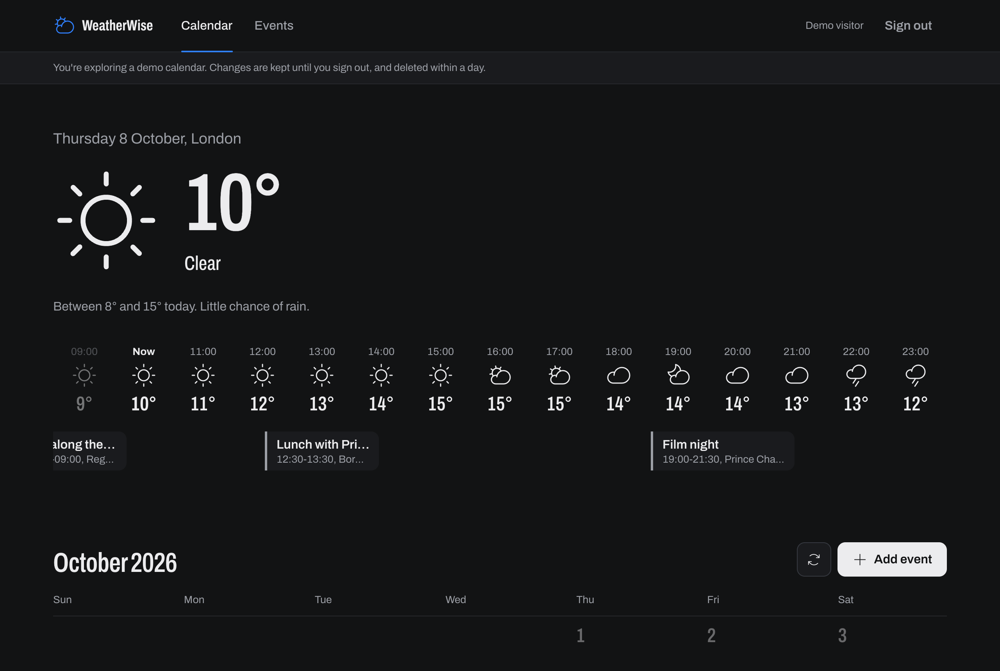
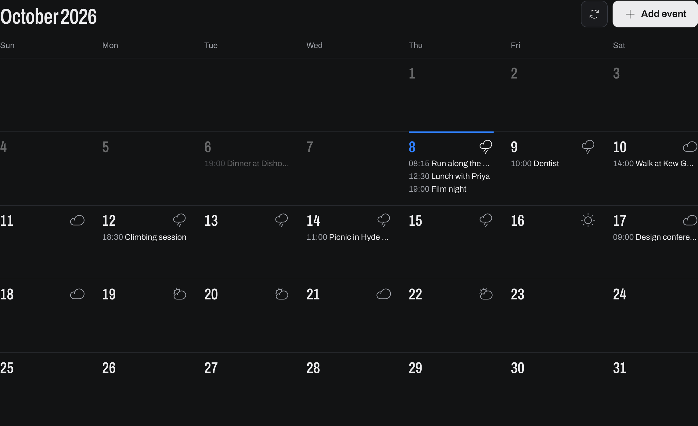
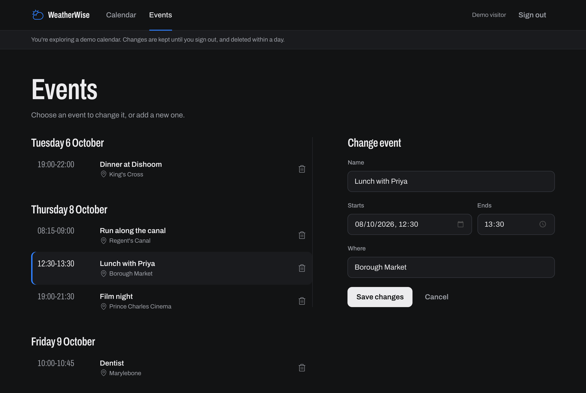
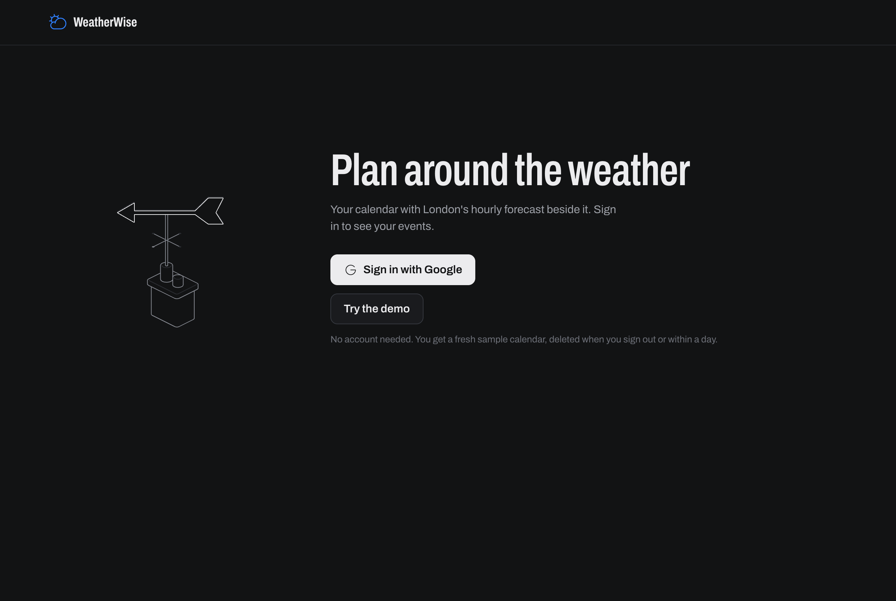
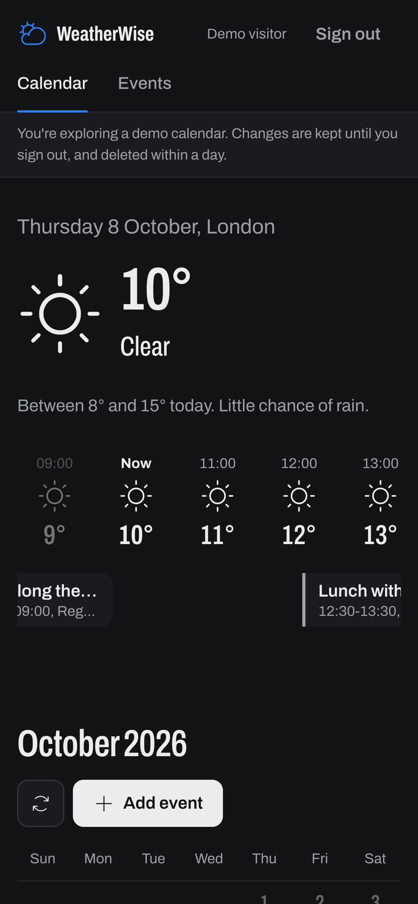
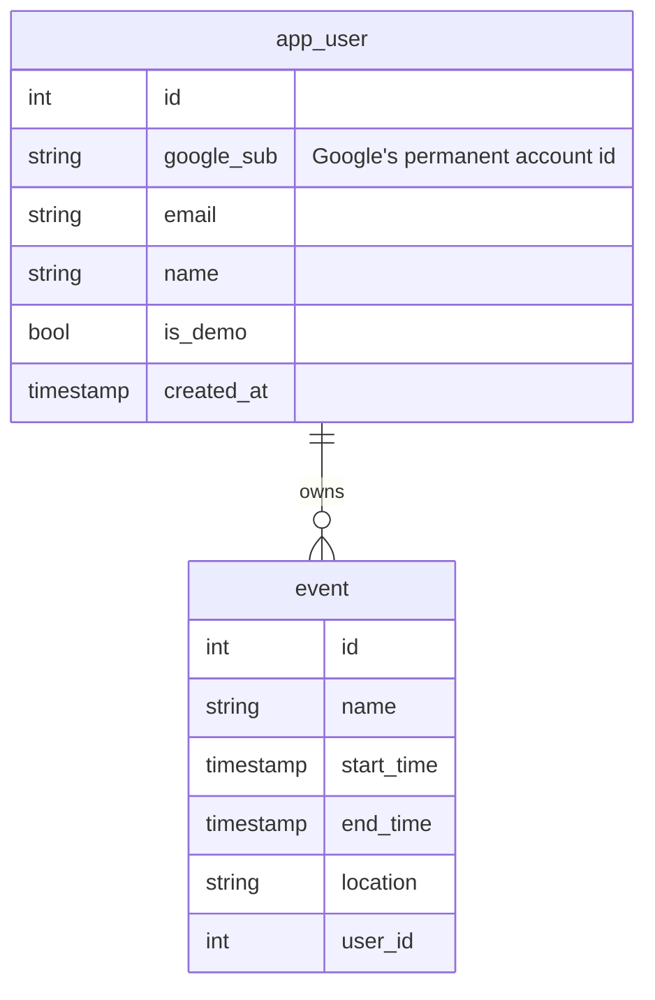

# WeatherWise Planner

> **Origin:** This project began as the [SSE TP1 Event Calendar](https://github.com/cindracindra/event-calendar-imperial-group-project), a group project for the Imperial College London MSc Software Systems Engineering, built by De Jun Tan, Cindra, Richard Lee and Timothy Ho. The group's final state is preserved at tag [`v1-group-project`](https://github.com/cindracindra/weatherwise-planner/tree/v1-group-project). All work after that tag is developed independently by Cindra.

[](https://github.com/cindracindra/weatherwise-planner/actions/workflows/ci.yml)

**Live demo:** https://weatherwise-planner.onrender.com (free hosting, so the first load after a quiet spell can take up to a minute). Use **Try the demo** to look around without an account.

## What it does

A personal calendar with London's weather beside it, so you can plan around the forecast.

- **Today at a glance:** current temperature and conditions, the day's range and when rain is most likely, with rain that sways as your cursor passes like a gust of wind.
- **Hour by hour:** a scrollable strip of today's hourly forecast, with your events laid along the same timeline.
- **The month:** daily weather and UK public holidays on every day, with your events.
- **Events:** add, change and delete events from one page.
- **Accounts:** sign in with Google; each person has their own private calendar.

## Screenshots

**Today and the hour-by-hour strip.** The current weather, the day's range, and the hourly forecast with today's events laid along the same timeline.



**The month.** Each day's forecast and events; today is marked in blue.



**Events.** Every event grouped by day; pick one to change it.



<table>
  <tr>
    <td width="62%"></td>
    <td width="38%"></td>
  </tr>
  <tr>
    <td><b>Sign in</b> with Google, or try a demo calendar without an account. The weather vane turns to follow your cursor.</td>
    <td><b>On a phone</b>, the hourly strip scrolls sideways and the month collapses to dots.</td>
  </tr>
</table>

Screenshots use the demo account's sample events.

## How it's built

- **Flask** (Python), server-rendered with Jinja templates, plus a small JSON API
- **PostgreSQL** (Neon) through SQLAlchemy
- **Open-Meteo** for weather (with **MET Norway** as an automatic backup) and **Nager.Date** for public holidays
- **Sign-in:** Google OpenID Connect via Authlib, sessions via Flask-Login, CSRF protection via Flask-WTF
- Hosted on **Render**; CI on **GitHub Actions** (flake8 and pytest on every push and pull request)

```
Browser ──▶ Flask app ──┬─▶ web_routes (pages)  ─┐
                        ├─▶ api_routes (JSON)   ─┼─▶ database/ ──▶ PostgreSQL
                        └─▶ auth_routes (sign-in)┘   services/ ──▶ Open-Meteo, Nager.Date
```

### Data model



One calendar per person: every event belongs to exactly one account, and every query is limited to the signed-in account. Someone else's event is reported as "not found".

## Accounts and security

- **Sign in with Google** (scopes `openid email profile` only). Accounts are matched on Google's permanent id, never on email.
- **Sessions** are signed cookies (`SECRET_KEY`) holding only the user id: HttpOnly, SameSite=Lax, HTTPS-only in production, 30 days.
- **Every page and API call needs a signed-in user.** Pages redirect to sign-in; the API answers `401`.
- **CSRF tokens** on every form. The JSON API is exempt: browsers won't send JSON, PATCH or DELETE to it from another site.
- **Try the demo** creates a fresh throwaway account with sample events. It's deleted on sign-out or within a day, and at most 200 exist at once.
- **Errors** are logged on the server; visitors only see a plain message.

## Running it locally

1. Create a virtual environment and install dependencies:
   ```bash
   python -m venv .venv && source .venv/bin/activate
   pip install -r requirements-dev.txt
   ```
2. Create a `.env` file (never committed):
   ```
   SECRET_KEY=<output of: python -c "import secrets; print(secrets.token_hex(32))">
   GOOGLE_CLIENT_ID=<from Google Cloud Console>
   GOOGLE_CLIENT_SECRET=<from Google Cloud Console>
   PGHOST=...  PGUSER=...  PGPASSWORD=...  PGDATABASE=...  PGPORT=5432
   ```
   Google's OAuth client needs the redirect URI `http://localhost:5050/auth/google/callback` (and the production one, `https://<your-host>/auth/google/callback`).
3. Create the tables on an empty database with `database/sql_scripts/SQL_command.sql`.
4. Run with `flask run --debug --port 5050`. In debug mode the sign-in page also offers **Continue as local developer**, which never appears in production.

### Database changes

Changes to a database that's already in use go in numbered migration scripts in `database/sql_scripts/`, run in order. Each is safe to run more than once.

| Script | What it does |
|---|---|
| `001_accounts.sql` | Adds accounts (`app_user`), gives every event an owner, removes the old profile tables. Events from before accounts existed are discarded. |

`SQL_command.sql` rebuilds everything from scratch and **deletes all data**; use it only for a new, empty database.

## API

All endpoints are under `/api`, need a signed-in session, and only ever see the signed-in account's events.

| Endpoint | Method | Description |
|---|---|---|
| `/api/events` | GET | Your events |
| `/api/events/<id>` | GET | One of your events |
| `/api/events` | POST | Create an event (JSON: `name`, `start_time`, `end_time`, `location`) |
| `/api/events/<id>` | PATCH | Change an event |
| `/api/events/<id>` | DELETE | Delete an event |

Responses share one shape: `{"statusCode": 200, "statusMessage": "SUCCESS", "data": {...}}`.

## Development

```bash
flake8 .
pytest tests/
```

The tests need no database or network: database and API calls are replaced with stand-ins. More detail in [`routes/README.md`](routes/README.md) (pages, API, sign-in), [`database/README.md`](database/README.md) (schema, migrations), [`services/README.md`](services/README.md) (weather, holidays, the calendar) and [`tests/README.md`](tests/README.md).

## Support

Please raise any issues or bugs via the [issue tracker](https://github.com/cindracindra/weatherwise-planner/issues).

## Contributing

Issues and pull requests are welcome. Please open an [issue](https://github.com/cindracindra/weatherwise-planner/issues) first to discuss larger changes, and make sure `flake8 .` and `pytest` pass before opening a pull request.

## Author

**Cindra** ([@cindracindra](https://github.com/cindracindra)), author and maintainer since the project became independent: the redesign, weather motion, accounts and Google sign-in, demo mode, and everything after tag [`v1-group-project`](https://github.com/cindracindra/weatherwise-planner/tree/v1-group-project).

**Original contributors** (the group project, up to `v1-group-project`): De Jun Tan, Cindra, Richard Lee and Timothy Ho.

## License

Released under the [MIT License](LICENSE). The original group-project code (up to tag `v1-group-project`) is copyright its four authors; later changes are copyright Cindra.

## Project status

Active
