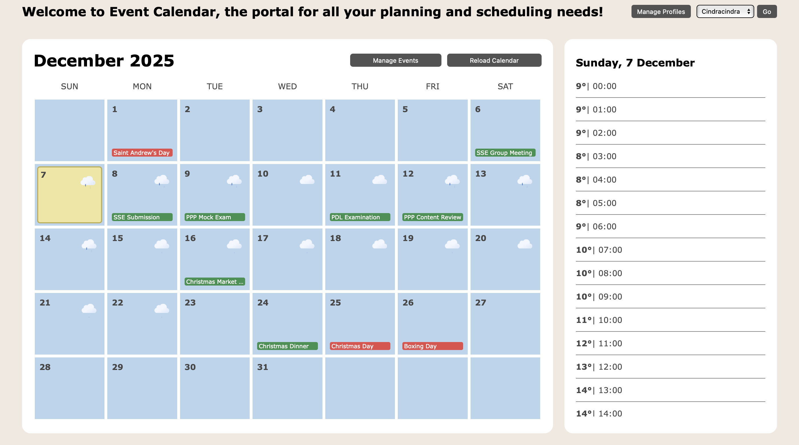
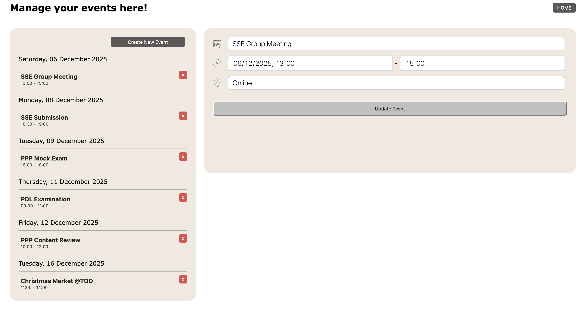
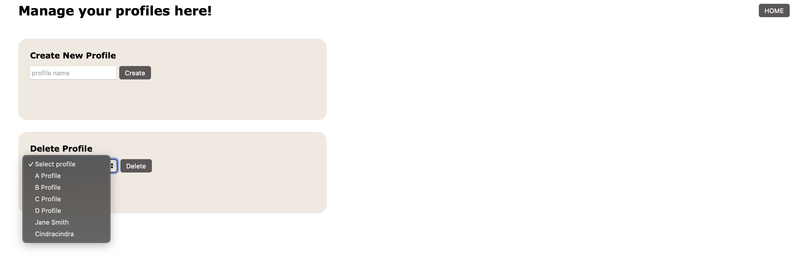

# WeatherWise Planner

> **Origin:** This project began as the [SSE TP1 Event Calendar](https://github.com/cindracindra/event-calendar-imperial-group-project), a group project for the Imperial College London MSc Software Systems Engineering, built by De Jun Tan, Cindra, Richard Lee and Timothy Ho. The group's final state is preserved at tag [`v1-group-project`](https://github.com/cindracindra/weatherwise-planner/tree/v1-group-project). All work after that tag is developed independently by Cindra.

## Name

WeatherWise Planner (formerly Event Calendar Web Application)

[](https://github.com/cindracindra/weatherwise-planner/actions/workflows/ci.yml)

## Description

Event Calendar is a WebApp built to provide scheduling and planning capabilities for individuals. Users would be able to plan activities and events in advance using real-time weather and environmental data for improved productivity and time management.

See the full list of planned and completed features in [Roadmap](#roadmap).

If you notice any bugs or issues with this project, report them using the [Issue Tracker](#support).

We welcome any and all contributions to this project. Please follow the steps listed in our [Ways of Working](#contributing) section.

## Architecture

### High-Level Diagram


### Database Schema


### Application Call Flow

```
┌────────────────────────────────────────┐
│  Client (Browser / HTTP Client)        │
└────────────────────────────────────────┘
                  ↓
┌────────────────────────────────────────┐
│  Flask Application                     │
└────────────────────────────────────────┘
                  ↓
┌─────────────┬──────────────────────────┐
│ web_routes  │  api_routes              │
│ (HTML)      │  (JSON)                  │
└─────────────┴──────────────────────────┘
                  ↓
┌────────────────────────────────────────┐
│  Logic Layer                           │
└────────────────────────────────────────┘
                  ↓
┌────────────────────────────────────────┐
│  PostgreSQL Database / External APIs   │
└────────────────────────────────────────┘
```

## Visuals

### Landing Page



The landing page presents the monthly calendar with weather icons and event badges displayed on each day. Next to the calendar, the daily timetable shows all events for that day along with hourly temperature data. A profile selection dropdown and a persistent navigation bar are also visible, supporting smooth transitions across the application.

### Event Management Page



The event management page displays a list of all events on the left, allowing users to select an event for editing. On the right, the form for creating or updating events is shown, enabling full modification of event details. Flash messages will appear at the top of the page, providing feedback on the success or failure of user actions.

### Profile Management Page



The profile management page lists all existing profiles and provides a form for creating new ones. Users can add or delete profiles directly from this interface. Flash messages will confirm the results of profile operations, ensuring clear and immediate feedback.

## User Guide

This application consists of three main pages, accessible through the persistent navigation bar at the top of the interface:

### 1. Landing Page (/)

- Landing page displays a monthly calendar with event badges and weather icons for each day.
- Profile dropdown at the top allows users to filter events by profile, automatically updating both the calendar and the daily timetable.
- Manage Profiles navigation button routes the user to the Profile Management Page, where they can create and delete profiles.
- Manage Events navigation button routes the user to the Event Management Page, where they can create, edit, and delete events; this button is only accessible once a profile has been selected.

### 2. Event Management Page (/management/event)

- The left panel lists all events booked under the selected profile.
- Users can edit an event by clicking it in the left panel, which populates the form on the right panel; changes can then be updated and submitted.
- The Create Event button opens an empty form with all necessary fields to create a new event.
- Each event in the list has a Delete button to remove it from the system.
- Flash messages appear at the top of the page after creating, updating, or deleting an event to provide feedback on the action.

### 3. Profile Management Page (/management/profile)

- Users can create new profiles using the Create Profile form.
- A selected profile can be deleted from the dropdown list using the Delete Profile button.
- Flash messages appear at the top of the page to confirm the success or failure of all profile operations.

#### Navigation Summary:

Home → Returns to the landing page
Manage Events → Open the event management interface
Manage Profiles → Open the profile management interface

The application is fully server-rendered; each action reloads the page to reflect updated data. Profile selection is preserved automatically across pages.

## API Endpoints

All API routes are prefixed with `/api`.

| Endpoint                   | Method | Description           |
| -------------------------- | ------ | --------------------- |
| `/api/events`              | GET    | Get all events        |
| `/api/events/<id>`         | GET    | Get event by ID       |
| `/api/events`              | POST   | Create event          |
| `/api/events/<id>`         | PATCH  | Update event          |
| `/api/events/<id>`         | DELETE | Delete event          |
| `/api/profiles`            | GET    | Get all profiles      |
| `/api/profiles/<id>`       | GET    | Get profile by ID     |
| `/api/profiles`            | POST   | Create profile        |
| `/api/profiles/<id>`       | DELETE | Delete profile        |
| `/api/event-profiles`      | GET    | Get all associations  |
| `/api/event-profiles/<id>` | GET    | Get association by ID |
| `/api/event-profiles`      | POST   | Create association    |
| `/api/event-profiles/<id>` | DELETE | Delete association    |

## Support

Please raise any issues or bugs via the [issue tracker](https://github.com/cindracindra/weatherwise-planner/issues).

## Roadmap

- [x] Monthly Calendar Overview
- [x] Display Real-time Weather on Calendar
- [x] Display Holidays on Calendar
- [x] Display Events on Calendar
- [x] Event Management (Query, Create, Update, & Delete)
- [x] Profile Management (Query, Create & Delete)
- [x] EventXProfile Management (Query, Create & Delete)
- [x] API Support for Event, Profile, EventXProfile

## Development

```bash
python -m venv .venv && source .venv/bin/activate
pip install -r requirements-dev.txt
flake8 .
pytest tests/
```

Every push to `main` and every pull request runs lint and tests via [GitHub Actions](https://github.com/cindracindra/weatherwise-planner/actions).

## Contributing

Issues and pull requests are welcome. Please open an [issue](https://github.com/cindracindra/weatherwise-planner/issues) first to discuss larger changes, and make sure `flake8 .` and `pytest` pass before opening a pull request.

## Authors

- De Jun Tan (dt525)
- Cindra (cc4625)
- Richard Lee (rl1625)
- Timothy Ho (tyh25)

## License

Released under the [MIT License](LICENSE). The original group-project code (up to tag `v1-group-project`) is copyright its four authors; later changes are copyright Cindra.

## Project status

Active

## Navigation

## 🎯 Quick Navigation

| Topic                           | Route                |
| ------------------------------- | -------------------- |
| Project Overview                | `/README.MD`         |
| Database Operations.            | `database/README.md` |
| API & Web Routes                | `routes/README.md`   |
| External APIs (Weather/Holiday) | `api/README.MD`      |
| Internal Services               | `services/README.MD` |
| Testing.                        | `tests/README.MD`    |
