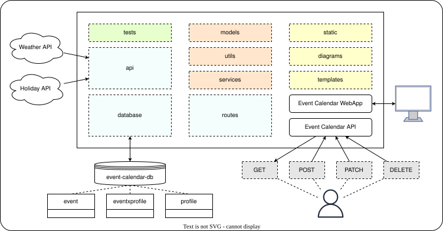
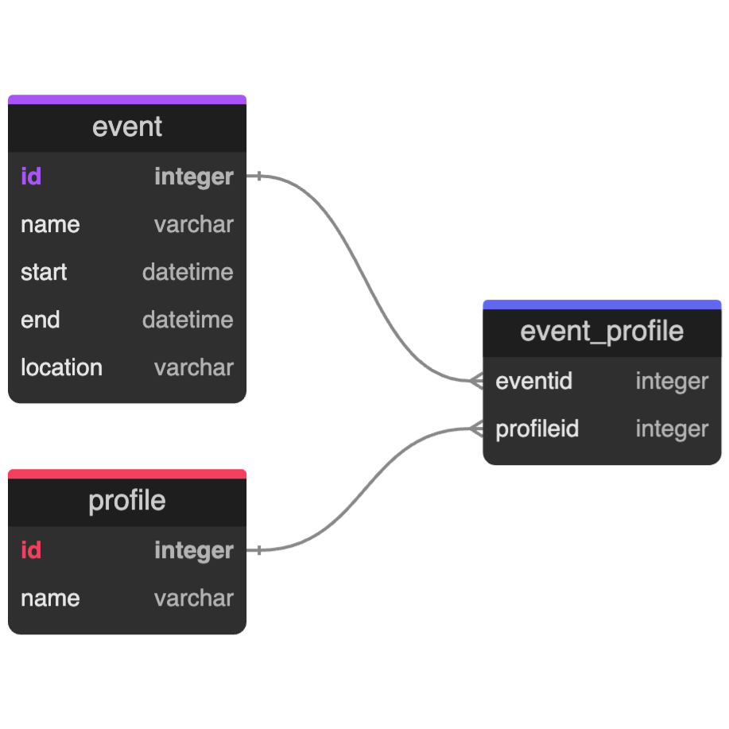

# SSE TP1 - Event Calendar

## Name

Event Calendar Web Application

## Description

Event Calendar is a WebApp built to provide scheduling and planning capabilities for individuals. Users would be able to plan activities and events in advance using real-time weather and environmental data for improved productivity and time management.

See the full list of planned and completed features in [Roadmap](#roadmap).

If you notice any bugs or issues with this project, report them using the [Issue Tracker](#support).

We welcome any and all contributions to this project. Please follow the steps listed in our [Ways of Working](#contributing) section.

## Architecture

### High-Level Diagram

### Database Schema

## Badges

[On some READMEs, you may see small images that convey metadata, such as whether or not all the tests are passing for the project. You can use Shields to add some to your README. Many services also have instructions for adding a badge.]

## Visuals

[Depending on what you are making, it can be a good idea to include screenshots or even a video (you'll frequently see GIFs rather than actual videos). Tools like ttygif can help, but check out Asciinema for a more sophisticated method.]

## Installation

[Within a particular ecosystem, there may be a common way of installing things, such as using Yarn, NuGet, or Homebrew. However, consider the possibility that whoever is reading your README is a novice and would like more guidance. Listing specific steps helps remove ambiguity and gets people to using your project as quickly as possible. If it only runs in a specific context like a particular programming language version or operating system or has dependencies that have to be installed manually, also add a Requirements subsection.]

## Usage

[Use examples liberally, and show the expected output if you can. It's helpful to have inline the smallest example of usage that you can demonstrate, while providing links to more sophisticated examples if they are too long to reasonably include in the README.]

## Support

Please raise any issues or bugs detected via our issue tracker [here](https://gitlab.doc.ic.ac.uk/msc-software-systems-engineering/sse-tp1/-/issues).

## Roadmap

- [ ] Monthly Calendar Overview
- [ ] Real-time Weather Feed on Calendar
- [ ] Event Management (Create & Delete)
- [ ] Event Management (Update)
- [ ] Display Events on Calendar

## Contributing

All contributors to this project should follow the following ways-of-working to ensure effective communication and collaboration.

- Create a new issue, task, or incident on our issue tracker [here](https://gitlab.doc.ic.ac.uk/msc-software-systems-engineering/sse-tp1/-/issues).
- Populate the ticket with the appropriate information and tag.
- Assign the ticket for someone to work on (this can also be done by Owners and Maintainers).
- From the ticket, create a new merge request. This also creates a new branch and you can make any changes there.
- Perform the relevant tests to ensure the new changes do not break existing functionality or intorduce new bugs.
- Once completed, create a pull/merge request to master branch.
- Assign a verified Owner or Maintainer to approve your pull/merge request.
- Once approved, your changes will be deployed via the automated deployment pipeline.

Thank you for contributing to this project!

## Authors

- De Jun Tan (dt525)
- Cindra (cc4625)
- Richard Lee (rl1625)
- Timothy Ho (tyh25)

## License

[For open source projects, say how it is licensed.]

## Project status

Active